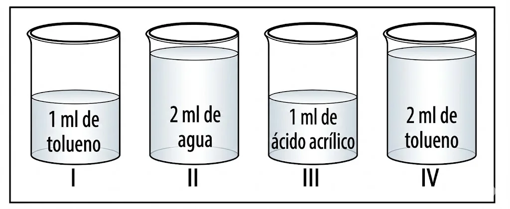

# Taller 1: La materia

## 1.

En clase de Ciencias el profesor explica que los elementos son un conjunto de átomos del mismo tipo que presentan las mismas características y los compuestos son la unión de dos o más elementos donde existe transformación de la materia; también explica que en las mezclas no hay transformación de la materia y estas pueden ser homogéneas si se observa una sola fase o heterogéneas si se observan dos o más fases. 

El profesor muestra la siguiente imagen con la transformación que tiene un candado de hierro (Fe) al ser expuesto al aire. Después de un tiempo, se observa un cambio en la coloración del candado.

El profesor indica que este proceso se puede explicar por medio de la siguiente reacción química:

$$4Fe + 3O_2 \rightarrow 2Fe_2O_3$$

Teniendo en cuenta la información anterior, ¿qué tipo de sustancia se forma?

- A. Un compuesto.
- B. Una mezcla homogénea.
- C. Un elemento.
- D. Una mezcla heterogénea.

✅ Respuesta

**Respuesta: A**

De acuerdo con la explicación del profesor, un compuesto es la unión de dos o más elementos donde existe una transformación de la materia. En la reacción mostrada, el hierro ($Fe$) y el oxígeno ($O_2$) se combinan químicamente para formar óxido de hierro ($Fe_2O_3$), que es una sustancia nueva con características diferentes a los elementos originales.

---

## 2.
Para la clase de Ciencias, Juan investiga sobre la variación de la temperatura de ebullición del agua en ciudades ubicadas a distintas alturas sobre el nivel del mar (m s. n. m.). Él encuentra datos para cinco ciudades y los registra en la siguiente tabla.

| Altitud (m s. n. m.) | 0 | 457 | 1.067 | 1.524 | 2.438 |
|---|---|---|---|---|---|
| **Temperatura de ebullición (°C)** | 100,0 | 98,5 | 96,0 | 94,5 | 91,5 |

Con base en los datos obtenidos, Juan afirma que "a medida que aumenta la altitud, disminuye la temperatura de ebullición del agua". ¿Esta afirmación puede considerarse una evidencia o una conclusión basada en los datos experimentales?

- A. Una conclusión, porque da una posible explicación al fenómeno observado.
- B. Una evidencia, porque tiene en cuenta las variables del experimento.
- C. Una conclusión, porque evalúa la tendencia de los datos contenidos en la tabla.
- D. Una evidencia, porque los datos obtenidos proceden de diferentes mediciones.

✅ Respuesta

**Respuesta: C**

La afirmación de Juan es una conclusión porque resume el patrón o tendencia observado en los datos (a mayor altitud, menor temperatura). Una evidencia sería un dato puntual de la tabla, mientras que la generalización a partir de esos datos constituye una conclusión.

## 3.
Una olla con agua hierve a una temperatura de 100 °C cuando está a una altura de 0 km. 

Teniendo en cuenta que el punto de ebullición es la temperatura a la cual la presión del vapor iguala a la presión atmosférica, si se pone a calentar la misma cantidad de agua a una altura de 25 km, puede afirmarse que el agua:

- A. hierve a una temperatura menor que 100 °C, porque la presión es menor.
- B. hierve a una temperatuzra mayor que 100 °C, porque la presión es menor.
- C. nunca hierve porque a esa altura hay poca cantidad de aire.
- D. se congelará porque al no haber aire, pasará a estado sólido.

✅ Respuesta

**Respuesta: A**

A mayor altitud, la presión atmosférica disminuye. Dado que el punto de ebullición es la temperatura donde la presión de vapor iguala la presión atmosférica, al haber menos presión externa, se requiere menos energía térmica (menor temperatura) para que el agua alcance el punto de ebullición.

## 4.

La siguiente tabla muestra los valores de la densidad de tres sustancias:

| Sustancia | Densidad (g/ml) a 25 °C |
|---|---|
| Tolueno | 0,78 |
| Ácido acrílico | 1,06 |
| Agua | 0,99 |

En cuatro recipientes se colocan volúmenes diferentes de cada líquido como se muestra en el dibujo:

De acuerdo con lo ilustrado es válido afirmar que:

- A. el recipiente IV es el que contiene menor masa.
- B. los recipientes II y IV contienen igual masa.
- C. el recipiente III contiene menor masa que el I.
- D. el recipiente II es el que contiene mayor masa.

✅ Respuesta

**Respuesta: D**

Para encontrar la masa, utilizamos la relación $m = d \times v$. Calculamos la masa para cada recipiente:
- Recipiente I (Tolueno): $1 \text{ ml} \times 0,78 \text{ g/ml} = 0,78 \text{ g}$
- Recipiente II (Agua): $2 \text{ ml} \times 0,99 \text{ g/ml} = 1,98 \text{ g}$
- Recipiente III (Ácido acrílico): $1 \text{ ml} \times 1,06 \text{ g/ml} = 1,06 \text{ g}$
- Recipiente IV (Tolueno): $2 \text{ ml} \times 0,78 \text{ g/ml} = 1,56 \text{ g}$

Comparando los valores, el recipiente II contiene la mayor masa ($1,98 \text{ g}$).

## 5.

Un investigador realizó un experimento en el que sometió un bloque de hierro a temperaturas muy altas. Él descubrió que la temperatura del hierro no cambia mientras cambia su fase. La siguiente tabla muestra los registros que hizo el investigador de temperatura, fase y cambios de fase del hierro durante su experimento.
 
| Temperatura (°C) | Estado del hierro |
| :---: | :---: |
| 0 | Sólido |
| 750 | Sólido |
| 1.535 | Cambio de sólido a líquido |
| 2.255 | Líquido |
| 2.750 | Cambio de líquido a gaseoso |
| 3.000 | Gaseoso |
 
¿Cuál de las siguientes gráficas corresponde a los datos de temperatura en el tiempo registrados por el investigador?
 

 
- A. Gráfica A
- B. Gráfica B
- C. Gráfica C
- D. Gráfica D
 
 

 
Ver respuesta correcta

 
 **Respuesta: C**
 
 **Explicación:**
 El enunciado establece claramente que **"la temperatura del hierro no cambia mientras cambia su fase"**. Esto es un principio fundamental de los cambios de estado (calor latente), lo que en una gráfica de Temperatura vs. Tiempo se representa como una **línea horizontal (meseta)** durante el cambio de fase.
 
 Observando los datos:
 *   A **1.535 °C** ocurre el cambio de sólido a líquido $\rightarrow$ **Debe haber una meseta horizontal**.
 *   A **2.750 °C** ocurre el cambio de líquido a gaseoso $\rightarrow$ **Debe haber otra meseta horizontal**.
 
 La **Gráfica C** es la única que muestra estos dos periodos de temperatura constante (líneas horizontales) correspondientes a los cambios de fase, mientras que en los estados intermedios (sólido, líquido, gaseoso) la temperatura aumenta (líneas diagonales).
 

## 6.

Para efectuar un procedimiento, un estudiante tiene las sustancias que se relacionan en la tabla.

| Propiedad | Sustancia 1 | Sustancia 2 | Sustancia 3 | Sustancia 4 |
| :--- | :---: | :---: | :---: | :---: |
| Punto de ebullición (°C) | -196 | 59 | -188 | -34 |
| ¿Es soluble en agua? | Sí | Sí | No | Sí |
| ¿Es conductora? | Sí | Sí | No | No |

Si el estudiante debe usar una sustancia cuyo punto de ebullición sea menor que 130 °C, soluble en agua y que no conduzca la electricidad, ¿cuál sustancia debería elegir?

- A. La sustancia 1.
- B. La sustancia 2.
- C. La sustancia 3.
- D. La sustancia 4.

✅ Respuesta

**Respuesta: D**

**Explicación:**
Para elegir la sustancia correcta, debemos filtrar las opciones según los tres criterios solicitados:
1.  **Punto de ebullición < 130 °C:** Todas las sustancias en la tabla cumplen este requisito (todas están por debajo de 60 °C).
2.  **Soluble en agua:** Las sustancias 1, 2 y 4 son solubles. Se descarta la sustancia 3.
3.  **No conductora de electricidad:** De las restantes (1, 2 y 4), la única que **no** es conductora es la **sustancia 4**. Las sustancias 1 y 2 sí conducen electricidad.

Por lo tanto, la **sustancia 4** es la única que cumple simultáneamente con todas las condiciones.

## 7.

La siguiente tabla muestra las propiedades físicas y químicas de diferentes materiales usados en la industria.

| Material | Densidad (g/cm³) | Conductividad eléctrica (S/m) | Punto de ebullición (°C) | Maleabilidad |
| :--- | :---: | :---: | :---: | :---: |
| Cobre | 8,96 | 58,5 × 10⁶ | 2.562 | Sí |
| Aluminio | 2,70 | 37,8 × 10⁶ | 2.470 | Sí |
| Acero inoxidable | 7,85 | 14,7 × 10⁶ | 3.000 | Sí |
| Hierro | 7,87 | 10,3 × 10⁶ | 2.862 | Sí |

Si se desea elegir un material con baja densidad que pueda ser usado para la elaboración de láminas que serán usadas en latas de gaseosa, ¿cuál sería el más adecuado?

- A. Cobre, porque tiene mayor conductividad y es maleable.
- B. Acero inoxidable, porque tiene el mayor punto de ebullición y alta densidad.
- C. Aluminio, porque posee la menor densidad y es maleable.
- D. Hierro, porque tiene la menor conductividad eléctrica y la mayor densidad.

✅ Respuesta

**Respuesta: C**

**Explicación:**
Para fabricar latas de gaseosa, se requiere un material que sea **maleable** (capacidad de transformarse en láminas delgadas) y que tenga una **baja densidad** para que el envase sea ligero. Al observar la tabla:

1.  Todos los materiales presentados son **maleables** (marcan "Sí").
2.  Al comparar las densidades, el **Aluminio** tiene el valor más bajo (2,70 g/cm³), lo que lo hace ideal para fabricar recipientes ligeros y resistentes.

## 8.

En una práctica de laboratorio, el profesor afirma que el agua y el aceite no se mezclan y pregunta: ¿el alcohol y el aceite se mezclan? Para responder la pregunta, solicita que mezclen las dos sustancias. 

Un estudiante escribe como hipótesis que estos dos líquidos se mezclan formando una solución homogénea; luego, vierte los dos líquidos en un recipiente, los agita y pasados unos minutos observa que se forman dos capas: en el fondo se encuentra el aceite y en la capa superior está el alcohol. 

Al analizar los resultados, ¿será válida la hipótesis del estudiante y qué conclusión se puede dar?

- A. La hipótesis es válida y se concluye que los resultados obtenidos se dieron debido a que estas sustancias no se mezclaron.
- B. La hipótesis es válida y se concluye que el alcohol tiene enlaces que impiden que se forme una mezcla heterogénea con el aceite.
- C. La hipótesis es falsa y se concluye que la mezcla obtenida luego de agitar las dos sustancias es de carácter homogéneo.
- D. La hipótesis es falsa y se concluye que el alcohol no se disuelve en el aceite, por lo que se obtiene una mezcla heterogénea.

✅ Respuesta

**Respuesta: D**

**Explicación:**
Una **hipótesis** es una suposición que debe ser probada mediante la experimentación. En este caso:
1.  **Hipótesis del estudiante:** El alcohol y el aceite forman una mezcla homogénea (se mezclan completamente).
2.  **Resultado experimental:** Se observan **dos capas** (fases), lo cual es la característica principal de una **mezcla heterogénea**.

Por lo tanto, la evidencia experimental contradice la suposición inicial, haciendo que la hipótesis sea **falsa**. La conclusión correcta es que las sustancias son inmiscibles (no se disuelven entre sí) y forman una mezcla heterogénea.

---

RESPONDA LAS PREGUNTAS 9 A 11 DE ACUERDO CON LA SIGUIENTE INFORMACIÓN

Las actividades agrícolas y ganaderas, así como la industria alimentaria, producen gran cantidad de residuos orgánicos que, al descomponerse, contribuyen al aumento de las emisiones de gases de efecto invernadero, como el vapor de agua ($H_2O$), el óxido nitroso ($N_2O$), el dióxido de carbono ($CO_2$) y el metano ($CH_4$). Este último es uno de los gases que más preocupa, ya que es 80 veces más contaminante que el $CO_2$. 

Un grupo de científicos realizó una consulta para determinar cuál ha sido el comportamiento de las emisiones anuales de $CH_4$ entre el 2000 e el 2020. Los resultados encontrados se muestran en la siguiente gráfica:

Luego de analizar los resultados, los científicos proponen implementar el uso de biodigestores a pequeña escala en las poblaciones rurales que generan grandes cantidades de residuos orgánicos. Los biodigestores aprovechan la **digestión anaerobia** (en ausencia de oxígeno) que realizan las bacterias para transformar los desechos orgánicos mezclados con agua en biogás y fertilizantes. El modelo y las especificaciones del biodigestor se muestran a continuación:

---

## 9.

De acuerdo con el modelo, ¿cuál es el manejo apropiado que se debe hacer para evitar la acumulación de gases y el aumento en la presión al interior del biodigestor?

- A. Depositar en el biodigestor diariamente todo tipo de residuos orgánicos e inorgánicos generados por los habitantes de la zona.
- B. Aumentar drásticamente la temperatura del biodigestor para acelerar el proceso de descomposición de los residuos orgánicos.
- C. Revisar constantemente la válvula de seguridad para evitar la acumulación de gases que puedan ocasionar la explosión del biodigestor.
- D. Retirar la válvula de seguridad para acelerar el proceso de descomposición de los residuos sólidos e incrementar la producción de biogás.

✅ Respuesta

**Respuesta: C**

**Explicación:**
En el modelo del biodigestor se observa una **válvula de seguridad**. Su función técnica en cualquier sistema que genere gases (como el metano y CO₂) es permitir la liberación controlada de presión excesiva. Revisarla constantemente asegura que el sistema no supere su límite de resistencia, previniendo accidentes como explosiones por sobrepresión.

## 10.

De acuerdo con los datos reportados en la gráfica, ¿cuál de las siguientes conclusiones responde adecuadamente la pregunta de los científicos?

- A. Las emisiones de gas metano aumentaron a más del doble entre el 2000 y el 2020.
- B. Las emisiones de gas metano se duplicaron entre el 2009 y el 2011.
- C. Las emisiones de gas metano se triplicaron entre el 2016 y el 2020.
- D. Las emisiones de gas metano se mantuvieron constantes entre el 2000 y el 2020.

✅ Respuesta

**Respuesta: A**

**Explicación:**
Analizando los valores de la gráfica:
*   En el año **2000**, las emisiones estaban cerca de las **6.000 toneladas**.
*   En el año **2020**, las emisiones superaron las **14.000 toneladas**.
Dado que 14.000 es más del doble de 6.000 (12.000), se concluye correctamente que las emisiones aumentaron a más del doble en ese periodo de 20 años.

## 11.

Se desea clasificar la mezcla inicial que se forma al agregar los residuos orgánicos en el biodigestor; si se sabe que una mezcla se clasifica en homogénea, donde no se pueden diferenciar a simple vista las partes que la componen, y heterogénea, donde se pueden diferenciar a simple vista las partes que la componen, ¿qué tipo de mezcla se tiene al inicio del proceso?

- A. Una mezcla heterogénea de biogás y fertilizantes como productos iniciales del proceso.
- B. Una mezcla homogénea de dióxido de carbono como único producto del proceso.
- C. Una mezcla heterogénea de estiércol de animales, residuos de alimentos y agua.
- D. Una mezcla homogénea de bacterias aerobias, biogás y estiércol de animales.

✅ Respuesta

**Respuesta: C**

**Explicación:**
Al inicio del proceso, los residuos orgánicos (como estiércol o restos de comida) se mezclan con agua. Debido a que estos residuos no se disuelven completamente y sus componentes (sólidos y líquidos) pueden distinguirse claramente a simple vista, la mezcla se clasifica como **heterogénea**. Las opciones A, B y D mencionan productos finales (biogás) o tipos de bacterias incorrectos para el estado inicial.

